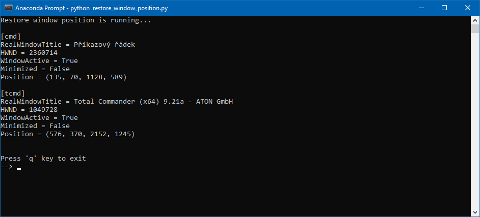

# RestoreWindowPosition

RestoreWindowPosition is simple script for Windows that can remember and restore window position. The window is identified by its name or using regular expression. Both configuration and saved window position is saved to INI file.



## Motivation

I got very frustrated by pop-up windows constantly opening on some default position. So it happened when using multi-monitor setup I wanted the window to open on exact monitor/position/size. For example that was the case with MS Visual Studio debug console. Using this script I can put the debug console on exact position on one of my 3 monitors.

## Features:

- find desired window by its window title in opened windows (UTF8)
- find desired child window (non-toplevel window) by its name
- find current window position every `refreshrateinsec`
- restore window last position if opened
- put window on top if `ontop` (very limited)
- save window position back to INI every `saverateinmin`

## Limitations

- put window on top is limited by Microsoft decision to suppress this functionality
- doesn't work for windows where the window title is changing (i.e. Spotify client shows current track name)

## Example INI file:

```ini
[DEFAULT]
refreshrateinsec = 0.5
saverateinmin = 1

[tcmd]
windowtitle = 'Total Commander.+'
useregex = 1
ontop = 1
casesensitive = 0
childwindow = 0
```

This example shows how to capture Total Commander window position even though Total Commander comes with this feature out-of-the box. We specified the name of the window using regular expression since Total Commander window name contains version number with licence information. 

```ini
[tcmd]
windowtitle = 'Total Commander.+'
useregex = 1
ontop = 1
casesensitive = 0
childwindow = 0
posx0 = 194
posy0 = 37
posx1 = 1770
posy1 = 912
```

Later when TCMD window is opened, position is retrieved and saved to config file. Next time you open the TCMD, window position gets restored to stored value.

## How to list all found window names?

If want to find a name of a window you are looking for try enabling `DEBUG_MODE`. Enabling will cause that all listed windows gets printed to console. This list gets printed out every `refreshrateinsec` so you might also want to increase that number for debugging purposes.
